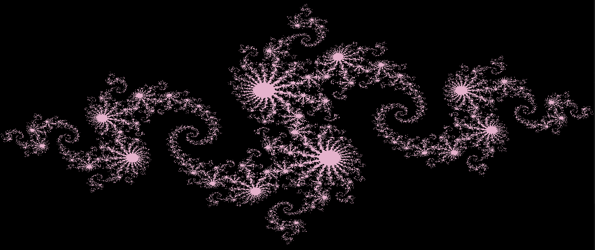

# Julia Set Fractal

My implementation of the Julia fractal exercise from the book CUDA by Example, highly modified to make use of CV2 instead of (presumably outdated) OpenGL as the original exercise uses.

Note: I only took this as far as I needed in order to see the fractal appear on my screen. It's still otherwise a mess.

Here's the output:
